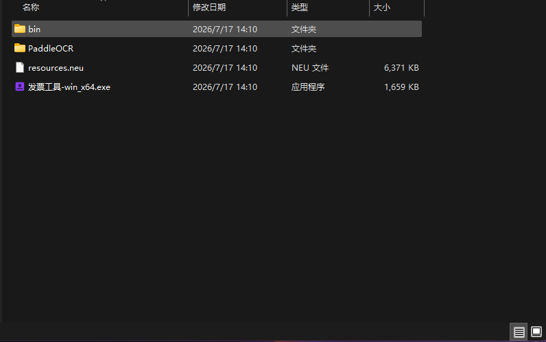
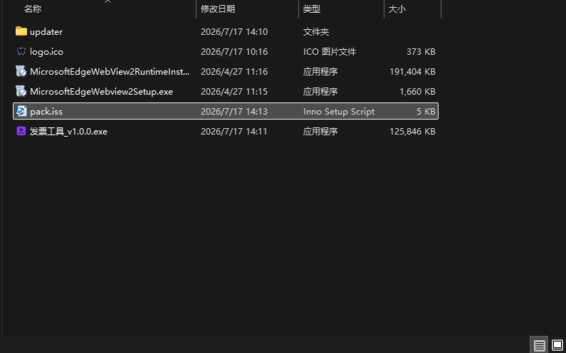

# 发票工具

一个运行在 Windows 上的桌面小工具，用来批量识别、管理和导出电子发票。

选一个放发票的文件夹，工具会自动扫描里面的 PDF / 图片，用本地 OCR 把发票信息读出来，存到本地数据库，之后可以搜索、编辑、导出成 Excel。

---

## 能做什么

- **批量扫描**：选择文件夹，自动处理其中的发票文件（PDF、图片）
- **离线 OCR**：本机识别，不上传外网，支持常见电子发票、铁路电子客票等
- **查询管理**：按发票号码、日期、购销方等条件筛选
- **编辑修正**：识别不准时，可手动改字段
- **导出 Excel**：把结果导出成表格，方便报销或归档

---

## 技术构成（简单了解即可）

| 部分 | 作用 |
|------|------|
| Neutralinojs | 桌面壳，提供窗口和本地文件能力 |
| Vue 3 + Vite + Element Plus | 界面 |
| Bun 扩展进程 | 后台服务：OCR、SQLite 数据库、HTTP/WebSocket |
| PaddleOCR-json | 本地文字识别引擎 |

开发时：前端走 Vite，后台由 `extensions/bun` 里的 Bun 跑起来。  
打包后：后台会编译成 `service.exe`，和 OCR 引擎一起打进安装包。

---

## 使用前准备

### 1. 环境要求

- Windows 10 / 11（x64）
- [Node.js](https://nodejs.org/)（建议 LTS）
- [pnpm](https://pnpm.io/)：`npm i -g pnpm`
- [Neutralino CLI](https://neutralino.js.org/docs/cli/neu-cli/)：`npm i -g @neutralinojs/neu`
- Bun 运行时（见下方说明，**仓库里没有带 bun.exe**）

### 2. 重要：下载 bun.exe

`bun.exe` **没有提交到 GitHub**（体积大，且已在 `.gitignore` 中忽略）。

克隆项目后，请自行下载 Bun，并把可执行文件放到：

```text
extensions/bun/bin/bun.exe
```

也就是：在 `extensions/bun` 下建好 `bin` 文件夹（若没有），把 `bun.exe` 放进去。

下载方式任选其一：

1. 打开 [Bun 官网](https://bun.com/) / [GitHub Releases](https://github.com/oven-sh/bun/releases)，下载 Windows 版
2. 或本机已安装 Bun 时，把安装目录里的 `bun.exe` 复制到上面的路径

放好后目录应类似：

```text
extensions/bun/bin/bun.exe
```

开发配置里启动命令依赖这个路径：

```text
extensions\bun\bin\bun  →  实际会用到 bun.exe
```

缺少该文件时，后台 OCR / 数据库服务起不来，界面无法正常识别发票。

### 3. 安装依赖

```bash
# 前端
cd resources
pnpm install

# 后台（Bun 侧）
cd ../extensions/bun
# 若已按上面放好 bun.exe，可用它安装依赖：
.\bin\bun.exe install
```

首次使用 Neutralino 时，在项目根目录执行一次：

```bash
neu update
```

---

## 本地开发运行

在项目**根目录**执行：

```bash
npm run win:dev
```

该命令会：

1. 把 `neutralino.dev.config.json` 复制为 `neutralino.config.json`（开发配置）
2. 启动 Neutralino 窗口，并拉起 Bun 扩展（OCR + 数据库服务）

前端由 Vite 热更新（默认 `http://localhost:5173`），改界面代码一般会自动刷新。

---

## 项目结构（精简）

```text
invoice/
├── resources/                 # 前端（Vue + Vite）
│   └── src/views/index/       # 扫描、搜索、列表、编辑、导出
├── extensions/bun/            # 后台扩展
│   ├── bin/bun.exe            # ⚠️ 需自行下载放入（不在仓库中）
│   ├── index.js               # 服务入口（OCR、API、WebSocket）
│   ├── db.js                  # SQLite 发票库
│   ├── parse-invoice.js       # OCR 结果清洗 / 字段解析
│   └── PaddleOCR/             # 离线 OCR 引擎
├── neutralino.*.config.json   # 开发 / 生产 / 测试配置
├── build.js                   # 打包辅助脚本
└── package.json
```

---

## 打包发布

整体分两步：**先编译出可运行目录**，再用 **Inno Setup Compiler** 打成安装包。

### 第一步：编译应用（打包示例）

在项目**根目录**打开 PowerShell，按下面示例逐行执行（可整段复制粘贴）：

```powershell
cp -Force neutralino.prod.config.json neutralino.config.json;
neu build;
mkdir -Force extensions/bun/bin/;
bun build --compile --minify --bytecode extensions/bun/index.js --outfile extensions/bun/bin/service.exe;
mkdir -Force dist/发票工具/bin/;
Move-Item -Force extensions/bun/bin/service.exe dist/发票工具/bin/service.exe;
Copy-Item -Path "extensions/bun/PaddleOCR" -Destination "dist/发票工具/" -Recurse -Force;
```

以上命令在做什么（按顺序）：

1. 切到生产配置 `neutralino.prod.config.json`
2. `neu build` 打出 Neutralino 产物到 `dist/发票工具/`
3. 用 Bun 把 `extensions/bun/index.js` 编译成 `service.exe`
4. 把 `service.exe` 挪到 `dist/发票工具/bin/`
5. 把整个 `PaddleOCR` 目录拷进 `dist/发票工具/`

编译完成后，把 `dist/发票工具/` 里需要发布的文件整理到安装打包目录的 `updater` 文件夹（可参考根目录 `build.js` 的拷贝逻辑）。`updater` 目录大致应如下图：



其中通常包含：

- `发票工具-win_x64.exe`：主程序
- `resources.neu`：前端资源包
- `bin/`：含 `service.exe` 等后台服务
- `PaddleOCR/`：离线 OCR 引擎及模型

### 第二步：用 Inno Setup 打安装包

准备一个独立的打包工作目录（示例：`invoice-updater`），放入：

- `updater/`：上一步整理好的程序文件
- `logo.ico`：安装包图标
- `MicrosoftEdgeWebview2Setup.exe`：WebView2 运行库安装程序（缺库时静默安装）
- `pack.iss`：Inno Setup 脚本

工作目录示例如下：



用 [Inno Setup Compiler](https://jrsoftware.org/isinfo.php) 打开 `pack.iss`，编译后会生成类似 `发票工具_v1.0.0.exe` 的可安装程序。

#### `pack.iss` 参考配置

路径、版本号、输出目录请按本机实际情况改 `MyOutputDir` 等宏。下面是一份可用的完整脚本：

```iss
#define MyAppName "发票工具"
#define MyAppVersion "1.0.0"
#define MyAppPublisher "发票工具"
#define MyAppURL "invoice"
#define MyAppExeName "发票工具-win_x64.exe"
#define MyOutputDir "C:\Users\Administrator\Desktop\invoice-updater"
#define MyInstallDir "invoice"
#define MyInstallPackageUUID "{4A2985FE-A67D-46F1-8E6D-068BD55D60A6}"

[Setup]
AppId={{#MyInstallPackageUUID}
AppName={#MyAppName}
AppVersion={#MyAppVersion}
AppPublisher={#MyAppPublisher}
AppPublisherURL={#MyAppURL}
AppSupportURL={#MyAppURL}
AppUpdatesURL={#MyAppURL}
DefaultDirName={autopf}\{#MyInstallDir}
UninstallDisplayIcon={app}\{#MyAppExeName}
ArchitecturesAllowed=x64compatible
ArchitecturesInstallIn64BitMode=x64compatible
DisableProgramGroupPage=yes
OutputDir={#MyOutputDir}
OutputBaseFilename={#MyAppName}_v{#MyAppVersion}
SetupIconFile={#MyOutputDir}\logo.ico
SolidCompression=yes
PrivilegesRequired=admin
; 禁用自带检测
CloseApplications=no
RestartApplications=no

[Languages]
Name: "chinesesimplified"; MessagesFile: "compiler:Languages\ChineseSimplified.isl"

[Tasks]
Name: "desktopicon"; Description: "{cm:CreateDesktopIcon}"; GroupDescription: "{cm:AdditionalIcons}"; Flags: checkedonce

[Files]
; 1. 释放主执行程序
Source: "{#MyOutputDir}\updater\{#MyAppExeName}"; DestDir: "{app}"; Flags: ignoreversion
; 2. 将 updater 下的 PaddleOCR 整个文件夹打包，并释放到安装目录的 PaddleOCR 下
; Flags 必须包含 recursesubdirs（递归子目录）和 createallsubdirs（创建所有子结构）
Source: "{#MyOutputDir}\updater\PaddleOCR\*"; DestDir: "{app}\PaddleOCR"; Flags: ignoreversion recursesubdirs createallsubdirs
; 3. 释放 updater 目录下的其他常规依赖和 bin 目录
Source: "{#MyOutputDir}\updater\*"; DestDir: "{app}"; Flags: ignoreversion recursesubdirs createallsubdirs
; 4. 释放临时的 WebView2 补丁包
Source: "{#MyOutputDir}\MicrosoftEdgeWebview2Setup.exe"; DestDir: "{tmp}"; Flags: deleteafterinstall

[Icons]
Name: "{autoprograms}\{#MyAppName}"; Filename: "{app}\{#MyAppExeName}"
Name: "{autodesktop}\{#MyAppName}"; Filename: "{app}\{#MyAppExeName}"; Tasks: desktopicon

[Registry]
; 强制以管理员权限运行
Root: HKLM; Subkey: "SOFTWARE\Microsoft\Windows NT\CurrentVersion\AppCompatFlags\Layers"; ValueType: string; ValueName: "{app}\{#MyAppExeName}"; ValueData: "~ RUNASADMIN"; Flags: uninsdeletevalue

[Run]
Filename: "{tmp}\MicrosoftEdgeWebview2Setup.exe"; Parameters: "/silent /install"; Check: NeedsWebView2; StatusMsg: "正在安装 WebView2 运行库..."
Filename: "{app}\{#MyAppExeName}"; Description: "{cm:LaunchProgram,{#StringChange(MyAppName, '&', '&&')}}"; Flags: nowait postinstall skipifsilent runascurrentuser

[Code]
procedure KillProcess(ProcessName: string);
var
  ResultCode: Integer;
begin
  // 增加对 service.exe 的强制结束
  Exec('taskkill.exe', '/f /im ' + ProcessName + ' /t', '', SW_HIDE, ewWaitUntilTerminated, ResultCode);
end;

// 停止并删除服务的函数
procedure StopAndRemoveService(ServiceName: string);
var
  ResultCode: Integer;
begin
  // 停止服务
  Exec('sc.exe', 'stop ' + ServiceName, '', SW_HIDE, ewWaitUntilTerminated, ResultCode);
  // 删除服务
  Exec('sc.exe', 'delete ' + ServiceName, '', SW_HIDE, ewWaitUntilTerminated, ResultCode);
end;

function PrepareToInstall(var NeedsRestart: Boolean): String;
begin
  // 1. 尝试结束进程
  KillProcess('Bun.exe');
  KillProcess('service.exe');
  KillProcess('{#MyAppExeName}');
  
  // 2. 如果 service.exe 是以服务名 "Bun" 或 "service" 注册的，尝试停止它
  // 注意：这里的参数需要填入你注册服务时的真实服务名称
  StopAndRemoveService('Bun'); 
  StopAndRemoveService('service');

  Sleep(1000); // 等待系统彻底释放文件
  Result := ''; 
end;

function NeedsWebView2(): Boolean;
var
  s: string;
begin
  Result := True;
  if RegQueryStringValue(HKLM, 'SOFTWARE\WOW6432Node\Microsoft\EdgeUpdate\Clients\{F3C4FE00-EFD5-403B-9569-398A20F1BA4A}', 'pv', s) or
     RegQueryStringValue(HKCU, 'Software\Microsoft\EdgeUpdate\Clients\{F3C4FE00-EFD5-403B-9569-398A20F1BA4A}', 'pv', s) then
  begin
    if s <> '' then Result := False;
  end;
end;
```

打包小提示：

- 改版本时同步改 `MyAppVersion`，输出文件名会变成 `发票工具_vX.Y.Z.exe`
- `MyOutputDir` 要指向你放 `updater`、`logo.ico`、`MicrosoftEdgeWebview2Setup.exe` 的那个目录
- 安装过程会检测是否已有 WebView2；没有则静默安装
- 安装前会尝试结束 `service.exe` / 主程序，避免文件被占用导致覆盖失败

---

## 常见问题

**Q：窗口能开，但识别一直没反应？**  
A：先确认 `extensions/bun/bin/bun.exe` 是否存在，以及 `extensions/bun/PaddleOCR/PaddleOCR-json.exe` 是否完整。

**Q：为什么 Git 里看不到 bun.exe？**  
A：故意不提交。请按上文「下载 bun.exe」一节自行放到指定目录。

**Q：数据存在哪？**  
A：本地 SQLite（如项目下的 `invoices.db` 等），不会默认上传到服务器。

---

## License

本项目采用 [Apache License 2.0](LICENSE) 开源协议。
